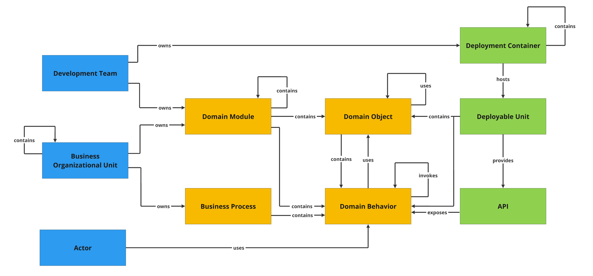

# P3 Model

This document describes all P3 Model *Elements* and *Relations*.

Elements are grouped into three perspectives:

* *Domain* – business concepts implemented in the system
* *Technology* – technical solutions used to run the system
* *People* – people who develop, maintain, and use the system

---

## Domain

### Domain Module

Domain Modules group related domain concepts into cohesive logical units. They contain Domain Objects, Domain Behaviors, and possibly other Domain Modules (nested modules). Each Domain Module is clearly owned by Development Teams and Business Organizational Units. 

If you are using DDD top-level modules usually correspond to Bounded Contexts, while submodules might represent Modules in DDD meaning.

**Relations:**

* contains Domain Object
* contains Domain Behavior
* contains Domain Module (nested)
* is owned by Development Team
* is owned by Business Organizational Unit

---

### Domain Object

Domain Objects represent business data and rules. They may include or be composed of Domain Behaviors, and they use other Domain Objects. They are used by Domain Behaviors to perform operations. Domain objects can be tagged with categories matching the architecutre style in the application. E.g. you can distinguish Entities, Services and Repositories. 

**Relations:**

* contains Domain Behavior
* uses Domain Object
* is used by Domain Behavior
* belongs to Domain Module

---

### Domain Behavior

Domain Behaviors implement domain functionality and logic. They may depend on Domain Objects and invoke other Domain Behaviors. They expose their functionality externally, typically through APIs. In addition selected behaviors can be tagged, for example to additionaly mark them as the entry points to the system.

**Relations:**

* uses Domain Object
* invokes Domain Behavior
* is exposed by API
* belongs to Domain Module / Domain Object / Business Process

---

### Business Process

Business Processes represent structured business workflows composed of domain logic. They coordinate Domain Behaviors to achieve business goals.

**Relations:**

* contains Domain Behavior
* is owned by Business Organizational Unit

---

## Technology

### Deployment Container

Deployment Containers represent runtime environments (e.g., servers, VMs, Kubernetes clusters, cloud services). They may contain other Deployment Containers and host Deployable Units.

**Relations:**

* contains Deployment Container
* hosts Deployable Unit

---

### Deployable Unit

Deployable Units are independently deployable software components (e.g., applications, services, functions). They are hosted in Deployment Containers and expose their features via APIs. They also contain Domain Objects and Domain Behaviors.

**Relations:**

* is hosted by Deployment Container
* contains Domain Object
* contains Domain Behavior
* provides API

---

### API

APIs provide access to functionalities offered by Deployable Units. They enable external systems or users to invoke Domain Behaviors.

**Relations:**

* is provided by Deployable Unit
* invokes Domain Behavior

---

## People

### Development Team

Development Teams consist of technical roles (e.g., developers, analysts, testers). They are responsible for building and maintaining Domain Modules and Deployment Containers.

**Relations:**

* owns Domain Module
* owns Deployment Container

---

### Business Organizational Unit

Business Organizational Units represent departments or organizational entities driving requirements and strategy. They own Domain Modules and Business Processes and may contain other Business Units.

**Relations:**

* owns Domain Module
* owns Business Process
* contains Business Organizational Unit

---

### Actor

Actors are system users who interact with Domain Behaviors as part of executing business tasks.

**Relations:**

* uses Domain Behavior
